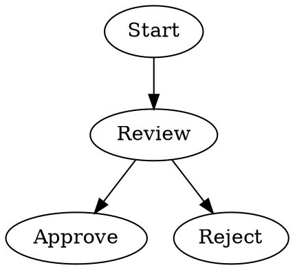
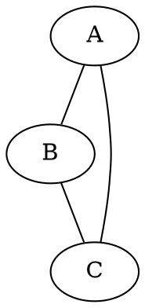
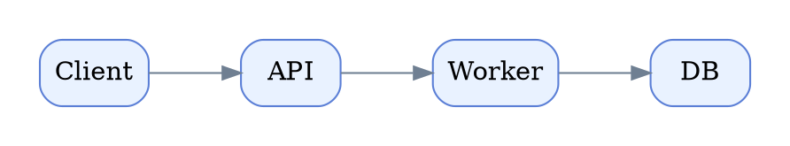
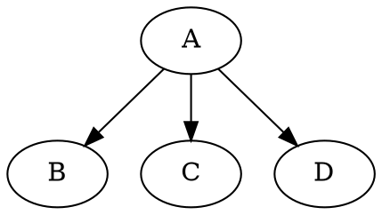
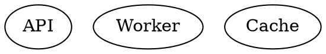
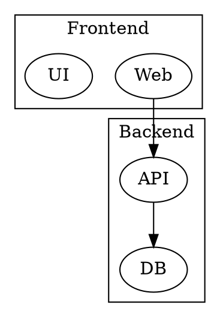
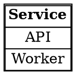

# Graphviz Browser Guide

Use this guide when the user wants Graphviz DOT diagrams plus browser-ready rendering.

Graphviz is excellent for auto-laid-out node-link diagrams, dependency graphs, trees, pipelines, clusters, and system maps where you want strong layout with very little manual positioning.

This guide is built from the core Graphviz DOT language documentation and the `dot` layout documentation, then translated into a copy-edit-render field manual for this skill.

## 1. When to Use Graphviz

Use Graphviz when the user wants:

- dependency graphs
- node-link system maps
- tree structures
- clustered architecture diagrams
- directed process graphs with strong automatic layout
- undirected relationship maps

Prefer Mermaid when the user wants common software-diagram syntax with lighter authoring.

Prefer Markmap when the source starts as a Markdown outline.

## 2. Core Mental Model

Graphviz takes DOT source and lays it out automatically.

Three things matter most:

1. choose `digraph` or `graph`
2. connect nodes with `->` or `--`
3. set attributes to influence layout and styling

## 3. Fastest Working Examples

### Directed graph



### Undirected graph



### Directed graph with layout defaults



## 4. DOT Abstract Grammar

This is the core DOT grammar pattern to keep around as reference.

```text
graph : [ strict ] (graph | digraph) [ ID ] '{' stmt_list '}'

stmt_list : [ stmt [ ';' ] stmt_list ]

stmt : node_stmt
     | edge_stmt
     | attr_stmt
     | ID '=' ID
     | subgraph

attr_stmt : (graph | node | edge) attr_list

attr_list : '[' [ a_list ] ']' [ attr_list ]

a_list : ID '=' ID [ (';' | ',') ] [ a_list ]

edge_stmt : (node_id | subgraph) edgeRHS [ attr_list ]

edgeRHS : edgeop (node_id | subgraph) [ edgeRHS ]

node_stmt : node_id [ attr_list ]

node_id : ID [ port ]

port : ':' ID [ ':' compass_pt ]
     | ':' compass_pt

subgraph : [ subgraph [ ID ] ] '{' stmt_list '}'

compass_pt : n | ne | e | se | s | sw | w | nw | c | _
```

## 5. Essential DOT Rules

### `digraph` vs `graph`

- `digraph` means directed edges and uses `->`
- `graph` means undirected edges and uses `--`

### IDs

An ID can be:

- an unquoted identifier like `API`
- a number
- a quoted string like `"Order Service"`
- an HTML string like `<TABLE>...</TABLE>`

Use quotes whenever labels contain spaces or punctuation.

### Comments and formatting

- `// comment`
- `/* comment */`
- semicolons are optional but recommended
- whitespace is flexible

### `strict`

Use `strict graph` or `strict digraph` to prevent duplicate edges between the same endpoints.

## 6. Attributes That Matter Most

### Graph attributes

```dot
graph [rankdir=LR, nodesep=0.5, ranksep=0.8, pad=0.3]
```

Useful graph attributes:

- `rankdir=TB` top-to-bottom layout
- `rankdir=LR` left-to-right layout
- `nodesep` horizontal spacing between nodes
- `ranksep` spacing between ranks
- `pad` breathing room around the drawing
- `splines=true` curved edges
- `layout=neato` switch engine from DOT source

### Node defaults

```dot
node [shape=box, style="rounded,filled", fillcolor="#e8f3ff", color="#5c82d6"]
```

Useful node attributes:

- `label`
- `shape`
- `style`
- `fillcolor`
- `color`
- `fontname`
- `fontsize`
- `width`
- `height`

### Edge defaults

```dot
edge [color="#6c7c92", penwidth=1.2]
```

Useful edge attributes:

- `label`
- `color`
- `penwidth`
- `style=dashed`
- `arrowhead`
- `minlen`
- `constraint=false`

## 7. Layout Engines

Graphviz supports multiple layout engines.

| Engine | Best for |
|---|---|
| `dot` | Hierarchical or layered directed graphs |
| `neato` | General undirected graphs, spring layouts |
| `fdp` | Force-directed graphs |
| `sfdp` | Large force-directed graphs |
| `circo` | Circular layouts |
| `twopi` | Radial layouts |
| `osage` | Cluster-heavy layouts |
| `patchwork` | Treemap-style clustered maps |

Practical default:

- use `dot` first
- switch to `neato` or `fdp` for undirected relationship maps
- use `circo` for cyclic structures
- use `twopi` for radial views

## 8. Subgraphs and Clusters

Subgraphs help in three ways:

- grouping graph structure
- setting local default attributes
- creating clusters

### Edge shorthand with subgraphs



Equivalent to:


### Same-rank grouping



### Clusters

If a subgraph name starts with `cluster`, Graphviz treats it as a cluster.



## 9. HTML-Like Labels

Graphviz supports HTML-like labels using angle brackets.



Use these sparingly. They are powerful, but more fragile than normal labels.

## 10. Starter Files

Use these when you want a close pattern fast:

| File | Use for |
|---|---|
| `starters/graphviz/decision-flow.dot` | Directed flow with branching |
| `starters/graphviz/cluster-system.dot` | Clustered system architecture |
| `starters/graphviz/network-map.dot` | Undirected relationship map |
| `starters/graphviz/same-rank-pipeline.dot` | Layered pipeline with aligned nodes |

Workflow:

1. Pick the closest starter.
2. Replace labels and edges.
3. Adjust a few attributes if needed.
4. Render in `templates/graphviz.html` or `templates/graphviz-editor.html`.

## 11. Browser Rendering Paths

### Option A: Quick Graphviz Viewer

Use `templates/graphviz.html` when you already have DOT and just want a browser render.

Replace:

- `{{TITLE}}`
- `{{DOT}}`

### Option B: Graphviz Editor Workspace

Use `templates/graphviz-editor.html` when the user should be able to edit DOT in the browser.

Replace:

- `{{TITLE}}`
- `{{DESCRIPTION}}`
- `{{INITIAL_DOT}}`

This template provides:

- a left-side DOT editor
- a layout-engine picker
- a render button
- a sample loader
- error reporting
- a browser-rendered SVG preview

## 12. Minimal Browser Template Example

```html
<!doctype html>
<html lang="en">
<head>
  <meta charset="utf-8" />
  <meta name="viewport" content="width=device-width, initial-scale=1" />
  <title>Graphviz Preview</title>
</head>
<body>
  <div id="graph"></div>
  <script id="dot-source" type="text/plain">digraph { A -> B }</script>
  <script type="module">
    import * as Viz from "https://cdn.jsdelivr.net/npm/@viz-js/viz@3.25.0/+esm";
    const viz = await Viz.instance();
    const dot = document.getElementById("dot-source").textContent;
    document.getElementById("graph").appendChild(viz.renderSVGElement(dot));
  </script>
</body>
</html>
```

## 13. Template Training Notes

### For `templates/graphviz.html`

- Put raw DOT into `{{DOT}}`
- Keep the DOT readable
- Default to `digraph` for process/system flows

Example replacement:

```python
render_template('graphviz.html', {
    'TITLE': 'Service Map',
    'DOT': '''digraph {
    rankdir=LR;
    Client -> API -> DB;
}'''
})
```

### For `templates/graphviz-editor.html`

- Put starter DOT into `{{INITIAL_DOT}}`
- Use `{{DESCRIPTION}}` to explain what the user should edit
- Prefer the editor when the user wants to tweak clusters, labels, or layout engines live

## 14. Good Defaults

- Start with `digraph` unless the relationships are truly undirected
- Start with the `dot` engine for directed systems
- Add graph, node, and edge defaults near the top
- Use `rankdir=LR` when wide process flow reads better left-to-right
- Use clusters for bounded domains or subsystems
- Use quoted labels when text contains spaces

## 15. Common Problems and Fixes

| Problem | Likely cause | Fix |
|---|---|---|
| Nothing renders | DOT syntax error | Reduce to a tiny valid graph, then rebuild |
| Arrowheads look wrong | Used `graph` with `->` or `digraph` with `--` | Match graph type to edge operator |
| Layout feels chaotic | Wrong engine | Start with `dot`, switch only when needed |
| Cluster box does not appear | Subgraph name does not start with `cluster` | Rename to `cluster_*` |
| Labels break rendering | Unquoted punctuation or malformed HTML label | Quote labels or simplify HTML |
| Graph is too wide | Too many nodes in one rank | Add clusters, split graph, or adjust `rankdir` |

## 16. Rapid Repair

If a Graphviz render fails, try these in order:

1. Reduce to `digraph { A -> B }` and confirm the render path works.
2. Rebuild from the closest file in `starters/graphviz/`.
3. Quote labels that contain spaces or punctuation.
4. Remove HTML-like labels until the layout works.
5. Switch the engine only after the DOT source itself is valid.

## 17. Final Checklist

- `digraph` or `graph` matches the edge operator.
- Labels with spaces are quoted.
- Defaults are defined near the top when useful.
- Clusters are named `cluster_*` if clustering is intended.
- The selected template matches the need: viewer or editor.
