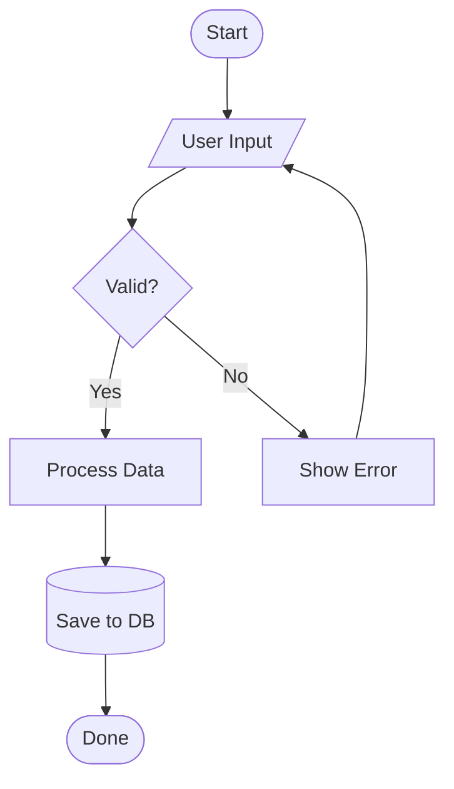
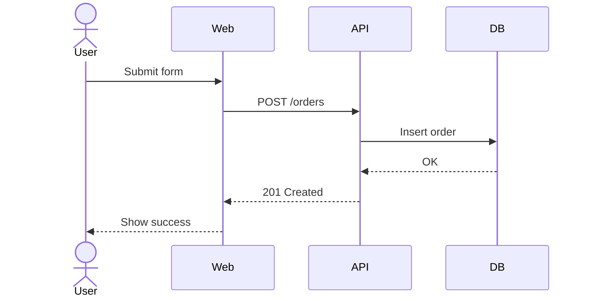
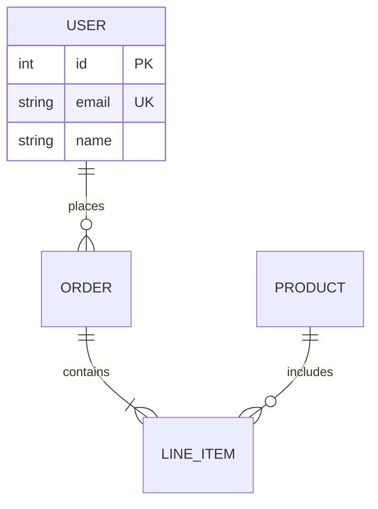
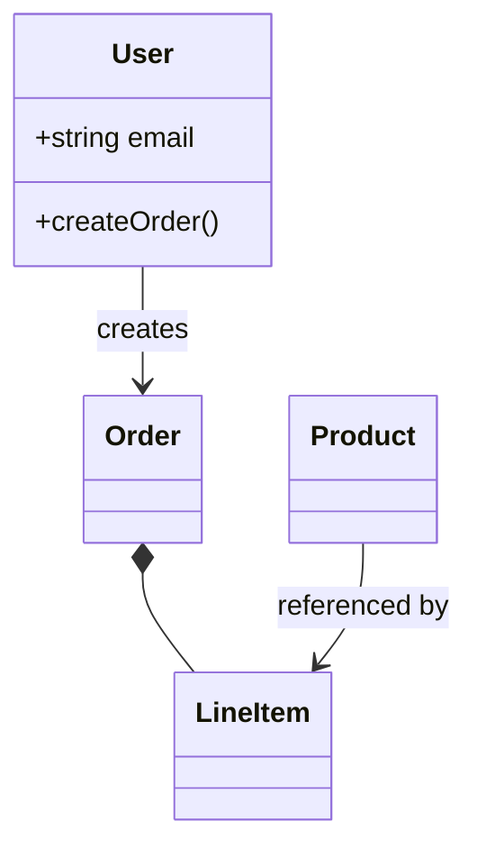
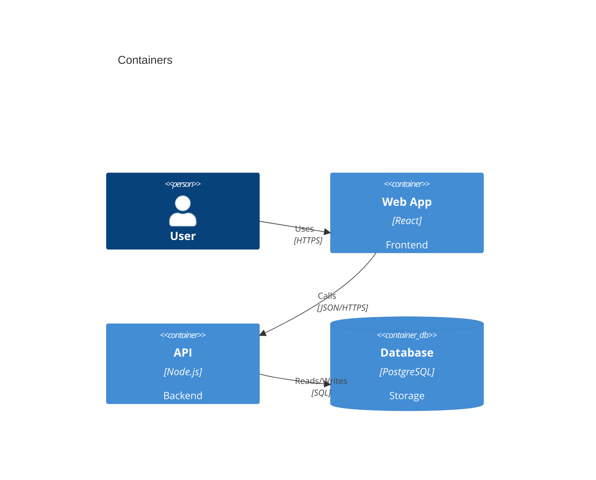
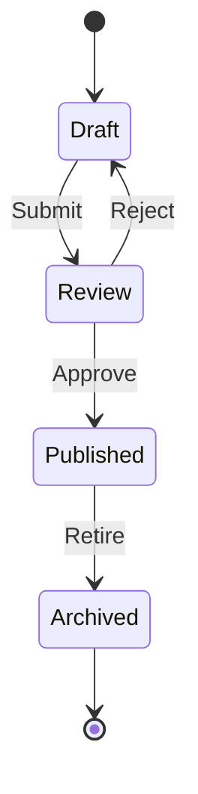
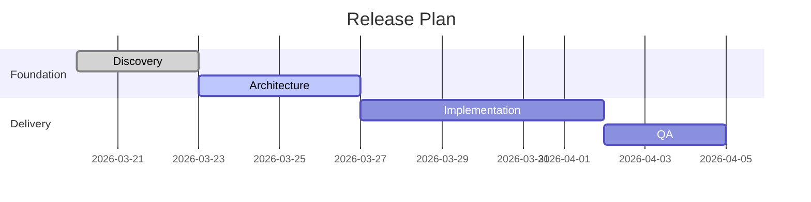
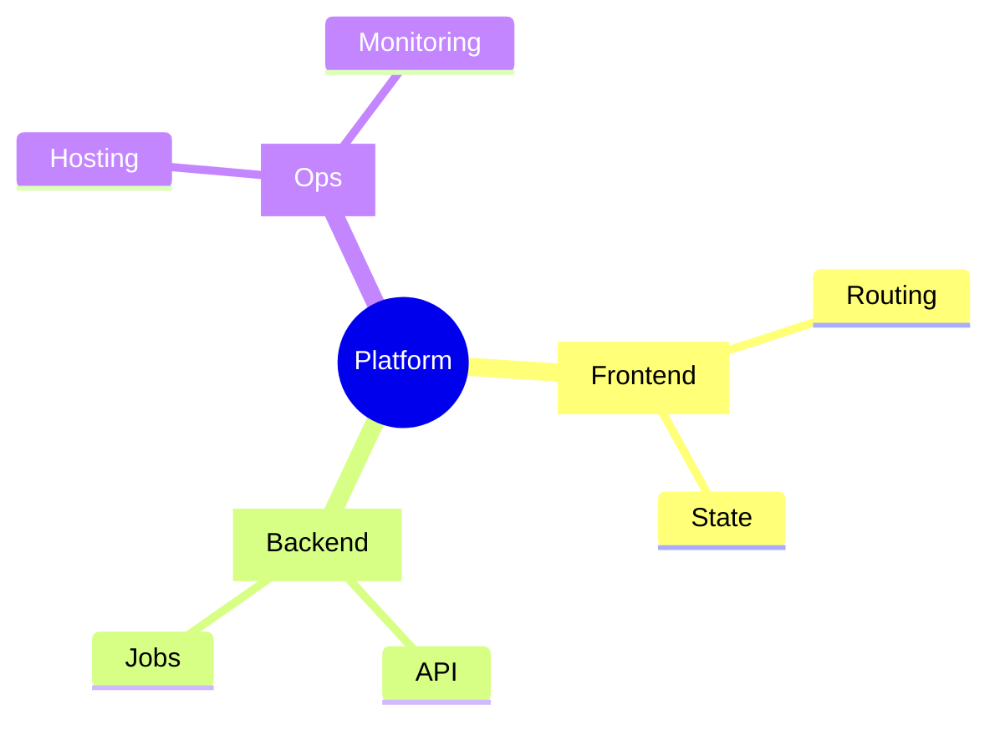

# Mermaid Browser Guide

Use this guide when the user wants Mermaid diagrams plus browser-ready rendering.

It is designed to be practical: pick a diagram type, write valid Mermaid quickly, then drop it into a local HTML template and open it in the browser.

## 1. When to Use Mermaid

Use Mermaid when the content is a graph, flow, interaction, or system model.

| Need | Mermaid type |
|---|---|
| Process with decisions | `flowchart` |
| API or service interactions | `sequenceDiagram` |
| Database structure | `erDiagram` |
| Object model | `classDiagram` |
| System architecture | `C4Context`, `C4Container`, `C4Component` |
| State transitions | `stateDiagram-v2` |
| Project timeline | `gantt` |
| Compact tree view | `mindmap` |

Use Markmap instead when the source naturally begins as a Markdown outline, notes page, or document summary.

## 2. Core Mermaid Rules

- The first line is always the diagram type.
- Keep labels short and explicit.
- Use one diagram per concept.
- Split large systems into multiple views instead of forcing everything into one block.
- Mermaid fails quietly on bad syntax, so write conservatively.

Base pattern:

```mermaid
diagramType
  definition content
```

## 3. Diagram Selection Cheat Sheet

### Flowchart

Best for logic, branching, workflows, user flows, and approval paths.



Useful shapes:

- `[text]` process
- `([text])` start or end
- `{text}` decision
- `[/text/]` input or output
- `[(text)]` data store
- `((text))` connector

### Sequence Diagram

Best for request-response chains, auth flows, async calls, and system interactions.



### ER Diagram

Best for schema design and entity relationships.



### Class Diagram

Best for object relationships and class structure.



### C4 Diagram

Best for architecture views.



### State Diagram

Best for lifecycle transitions.



### Gantt

Best for schedules and delivery plans.



### Mermaid Mindmap

Best for compact tree views when the user specifically wants Mermaid.



Mindmap rules:

- First line: `mindmap`
- Root on the second line
- Use spaces only
- Keep indentation consistent
- No blank lines inside the block
- Keep node text short

Useful shapes:

- `((Node))` root only
- `[Node]` concrete module or category
- `(Node)` process or action
- `{Node}` uncertain item or idea
- `))Node((` warning or critical item

## 4. Mermaid Authoring Workflow

1. Pick the diagram type from the need, not from habit.
2. Extract only the key actors, nodes, or states.
3. Keep labels compact.
4. Write the Mermaid block.
5. Render it in the browser template.
6. Fix any parser errors before returning it as final output.

## 5. Browser Rendering Paths

### Option A: Quick Mermaid Viewer

Use `templates/mermaid.html` when you already have valid Mermaid and just want to open it.

Replace:

- `{{TITLE}}`
- `{{DIAGRAM}}`

Best for one-shot previews.

### Option B: Mermaid Editor Workspace

Use `templates/mermaid-editor.html` when you want a ready-to-edit browser workspace.

Replace:

- `{{TITLE}}`
- `{{DESCRIPTION}}`
- `{{INITIAL_DIAGRAM}}`

This template gives you:

- a left-side Mermaid editor
- a render button
- a sample loader
- inline error reporting
- a right-side browser preview

Best for iterative editing.

## 6. Starter Files

Use these when you want a near-ready source block fast:

| File | Use for |
|---|---|
| `starters/mermaid/flow-approval.mmd` | Branching process flow |
| `starters/mermaid/sequence-api.mmd` | API interaction flow |
| `starters/mermaid/erd-schema.mmd` | Database relationships |
| `starters/mermaid/state-lifecycle.mmd` | State machine or lifecycle |
| `starters/mermaid/architecture-container.mmd` | Container architecture |

Workflow:

1. Pick the closest starter.
2. Replace labels and entities.
3. Remove any unused lines.
4. Render in `templates/mermaid.html` or `templates/mermaid-editor.html`.

## 7. Minimal Browser Template Example

This is the smallest practical single-file Mermaid HTML page:

```html
<!doctype html>
<html lang="en">
<head>
  <meta charset="utf-8" />
  <meta name="viewport" content="width=device-width, initial-scale=1" />
  <title>Mermaid Preview</title>
  <script src="https://cdn.jsdelivr.net/npm/mermaid@11/dist/mermaid.min.js"></script>
  <script>
    mermaid.initialize({ startOnLoad: true, securityLevel: 'loose' });
  </script>
</head>
<body>
  <pre class="mermaid">
flowchart TD
    A[Start] --> B{Decision}
    B -->|Yes| C[Continue]
    B -->|No| D[Stop]
  </pre>
</body>
</html>
```

## 8. Template Training Notes

### For `templates/mermaid.html`

- Put raw Mermaid into `{{DIAGRAM}}`
- Do not HTML-escape the diagram unless your injection path requires it
- Keep the code readable so the user can inspect it later

Example replacement:

```python
render_template('mermaid.html', {
    'TITLE': 'Checkout Flow',
    'DIAGRAM': '''flowchart TD
    Cart --> Checkout
    Checkout --> Payment
    Payment --> Success'''
})
```

### For `templates/mermaid-editor.html`

- Put starter Mermaid into `{{INITIAL_DIAGRAM}}`
- Use `{{DESCRIPTION}}` to explain the purpose of the workspace
- Prefer this template when the user wants to tweak the diagram after opening it

## 9. Good Defaults

- `flowchart TD` for most process diagrams
- `sequenceDiagram` for API and auth flows
- `stateDiagram-v2` for lifecycle changes
- `C4Container` for service architecture
- `gantt` for timelines tied to dates

## 10. Common Mistakes

| Problem | Cause | Fix |
|---|---|---|
| Blank render | Invalid Mermaid syntax | Simplify and validate line by line |
| Wrong diagram type | Picked a familiar type instead of the right one | Re-select based on structure |
| Diagram too wide | Labels too long | Shorten text and split the diagram |
| Hard to read | Too many nodes | Create multiple focused diagrams |
| Mindmap breaks | Bad indentation or special characters | Use spaces only and simplify labels |

## 11. Rapid Repair

If a Mermaid render fails, try these in order:

1. Remove advanced syntax and keep only the core nodes and edges.
2. Switch to the closest file in `starters/mermaid/`.
3. Shorten labels to a few words.
4. Split the content into two smaller diagrams.
5. Open it in `templates/mermaid-editor.html` so the user can inspect and tweak it.

## 12. Final Checklist

- Diagram type matches the request.
- Labels are short and scannable.
- Mermaid block is syntactically consistent.
- Browser template placeholders are fully replaced.
- If the user asked for editable output, use the editor template.
